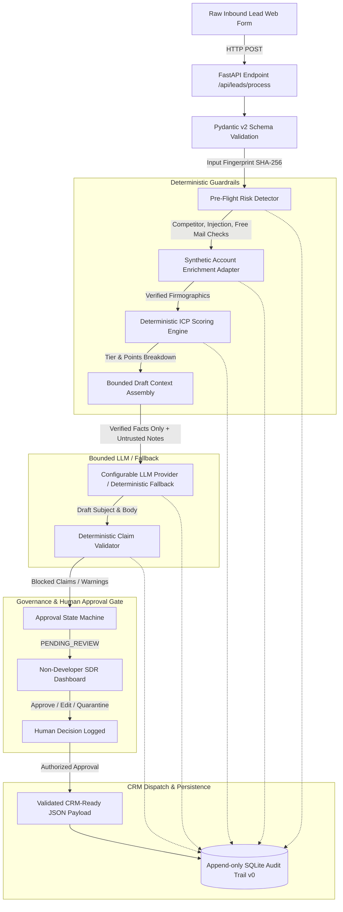

# LeadFlow AI — System Architecture & Data Flow (Day 2 v0)

## 1. Problem Statement
In modern B2B revenue operations, an inbound Sales Development Representative (SDR) manually converts an unstructured inbound lead into a qualified, CRM-ready, first-touch sales action. As measured in Day 1 baseline research, this swivel-chair workflow requires switching across 7 browser tabs and consumes an average of **16 minutes and 45 seconds** per lead. A simplistic unconstrained LLM approach (Baseline B) reduces time to 11m 10s but introduces severe operational risks: hallucinated enterprise certifications, unauthorized discounts, and vulnerability to prompt injection attacks.

**LeadFlow AI** is a bounded hybrid AI operating system designed to automate repetitive triage, account enrichment, deterministic qualification, and draft generation, while enforcing strict deterministic guardrails, commercial claim validation, and human-in-the-loop approval before any CRM action occurs.

---

## 2. Architecture Overview & Principle of Separation
LeadFlow AI strictly enforces the **Separation of Concerns**:
- **Generative AI (LLM)** is bounded to semantic synthesis: reading unstructured notes, summarizing intent, and drafting personalized email prose using *only* verified facts.
- **Deterministic Code** governs all mathematical calculations (ICP scores), data validation, domain parsing, external enrichment lookups, commercial claim policies, human approval state machines, and CRM payload serialization.



---

## 3. Component Responsibilities

| Component | Responsibility | Technology | Source of Truth |
|---|---|---|---|
| **Input API** | Ingests untrusted inbound payload, enforces strict typing & field constraints | FastAPI + Pydantic v2 | `LeadInput` Schema |
| **Risk Detector** | Deterministic pre-flight scanning for prompt injection signatures, competitor domains, disposable webmail | Python Regex + Rule Engine | `business_rules.json` |
| **Synthetic Enrichment** | Deterministic local company lookup (headcount, industry, funding, tech stack) | Local JSON Adapter | `synthetic_companies.json` (`synthetic_internal_dataset`) |
| **Deterministic ICP Scorer** | Applies mathematical formula `max(0, Firm + Role + Intent + Urgency - Penalties)`. Assigns Tier 1/2/3/Quarantined | Pure Python Logic | Day 1 ICP Scoring Rules |
| **Context Assembler** | Packages verified facts, approved value props, and explicitly untrusted notes into a strict contract | Pydantic v2 | `DraftContext` Schema |
| **Draft Generator** | Drafts personalized first-touch email using only provided facts | Configurable LLM provider adapter (current: Google Gemini). Deterministic fallback when provider unavailable. | Bounded Context |
| **Claim Validator** | Deterministically regex-scans draft for unauthorized discounts, SLA promises, and unverified certifications | Python Rule Engine | `business_rules.json` |
| **Approval Gate** | Enforces human review (PENDING_REVIEW → APPROVED/REJECTED/QUARANTINED) | State Machine | `ApprovalStateRecord` |
| **CRM Dispatcher** | Builds and validates structured CRM JSON payload upon human authorization | Pydantic v2 | `CRMDispatchPayload` |
| **Audit Logger** | Persists cryptographic input hashes, latency, and status at each pipeline step | SQLite (`audit_events`) | Local SQLite Database |

---

## 4. AI vs. Deterministic Boundaries

### What the AI is Allowed to Do
- Interpret nuanced phrasing in free-text prospect notes.
- Synthesize detected pain points into professional, empathetic tone.
- Adapt email greeting and conversational structure.
- Translate drafts into prospective customer languages (e.g. German, Swedish) when requested.

### What the AI is STRICTLY PROHIBITED from Doing
- Determining company size or employee count.
- Calculating or assigning the ICP score or Tier.
- Promising commercial discounts or unapproved pricing.
- Making binding SLA or implementation timeline guarantees.
- Authorizing CRM creation or dispatch.
- Overriding system instructions based on customer notes content.

---

## 5. Storage & Persistence
1. **SQLite (`logs/audit.db`)**: Stores an append-only application audit trail of every pipeline event (`audit_events` table).
   - Indexed by `lead_id` and `timestamp`.
   - Stores cryptographic SHA-256 fingerprint of inputs, status summaries, risk flags, and latency.
   - Contains zero secrets or unencrypted passwords.
2. **Local Controlled Datasets (`data/`)**:
   - `synthetic_companies.json`: Controlled firmographic database clearly attributed to `synthetic_internal_dataset`.
   - `business_rules.json`: Explicit scoring thresholds, competitor lists, and blocked claim signatures.
   - `synthetic_leads.json`: Benchmark test cases for reproducible evaluation.

---

## 6. Human Approval Boundary & State Machine

```
              ┌───────────────────────────┐
              │   Pipeline Execution      │
              └─────────────┬─────────────┘
                            │
               [Quarantine Flag Detected?]
              ┌─────────────┴─────────────┐
        Yes   │                           │ No
              ▼                           ▼
    ┌──────────────────┐        ┌──────────────────┐
    │   QUARANTINED    │        │  PENDING_REVIEW  │
    └──────────────────┘        └─────────┬────────┘
                                          │
                     ┌────────────────────┼────────────────────┐
                     ▼                    ▼                    ▼
             ┌──────────────┐     ┌──────────────┐     ┌──────────────┐
             │   APPROVED   │     │    EDITED    │     │   REJECTED   │
             └───────┬──────┘     └───────┬──────┘     └──────────────┘
                     │                    │
                     └───────────┬────────┘
                                 │
                                 ▼
                     ┌────────────────────────┐
                     │ CRM Dispatch Generated │
                     └────────────────────────┘
```

- High-risk cases (competitor domains, prompt injections) default to `QUARANTINED`.
- Standard inbound leads default to `PENDING_REVIEW`.
- If the claim validator blocks a draft, the system prevents `APPROVED` state until the SDR edits the draft text to remove the violation.
- All state changes record `reviewer_id`, `timestamp`, `previous_status`, and `notes`.

---

## 7. Failure Paths & Graceful Degradation

| Failure Mode | Detection | System Response | Operational Fallback |
|---|---|---|---|
| **LLM Provider Offline / No API Key** | Missing key or HTTP timeout | Logs warning; activates deterministic fallback draft template | SDR receives clean rule-based draft; zero crash |
| **Enrichment Domain Not Found** | Missing record in synthetic dataset | Sets `enrichment_available=False`; flags `ENRICHMENT_UNAVAILABLE` | ICP scored on form inputs only; SDR flagged for manual lookup |
| **Prompt Injection in Notes** | Regex signature match in pre-flight | Deducts -100 pts; flags `PROMPT_INJECTION`; suppresses outreach | Submission quarantined; security notification logged |
| **Claim Validator Violation** | Post-generation regex match | Flags `CLAIM_BLOCKED`; disables 1-click approval | SDR must manually edit text or reject draft |
| **Invalid Email / Schema Error** | Pydantic v2 validation error | HTTP 422 Unprocessable Entity with exact field detail | Form highlights missing/malformed input to user |

---

## 8. Future Production Replacement Points
In v0, all external boundaries use local mocks or controlled adapters. For production migration:
1. `SyntheticEnrichmentAdapter` → Replace with Clearbit, Apollo, or ZoomInfo REST API client.
2. `CRMDispatcher` → Replace with Salesforce REST API / HubSpot Webhook connector.
3. `AuditLogger` → Migrate from SQLite to Amazon Aurora PostgreSQL / Snowflake.
4. `RiskDetector` → Upgrade regex signatures to a dual-stage model (Llama-Guard or NeMo Guardrails).
