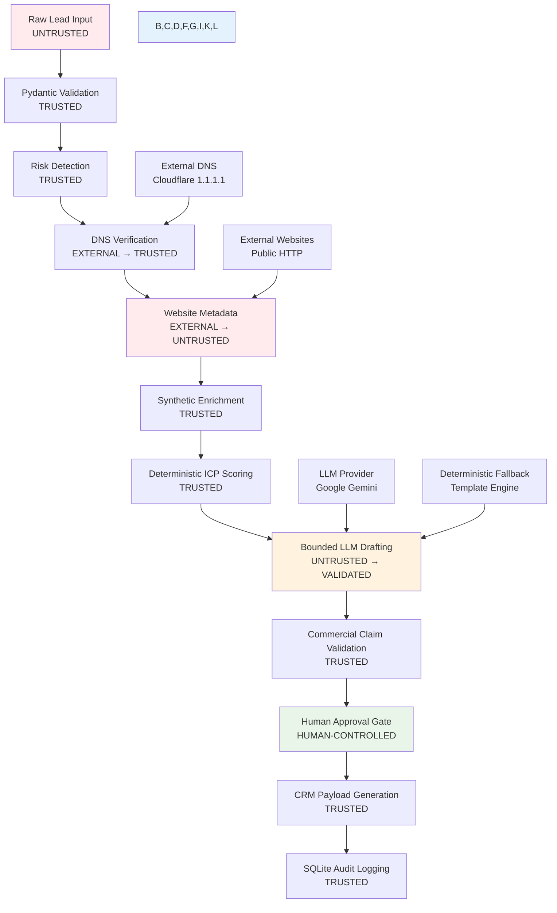

# LeadFlow AI Architecture Documentation

## Overview

LeadFlow AI is a **hybrid architecture** that combines deterministic business logic with bounded AI generation, enforcing strict human governance over all commercial communications.

## Core Design Principles

### 1. Trust Boundary Separation
The system maintains clear boundaries between trusted and untrusted components:

**TRUSTED (Deterministic):**
- Pydantic schema validation
- DNS verification results  
- Mathematical ICP scoring
- Routing decision logic
- Commercial claim validation regex
- Human approval state machine
- SQLite audit logging

**UNTRUSTED (External/Generated):**
- Raw lead form inputs
- Customer notes and descriptions
- External website content
- DNS resolution responses
- LLM draft generation output
- Third-party API responses

**HUMAN-CONTROLLED:**
- Final approval decisions
- Lead quarantine actions
- Draft editing and review
- Policy configuration updates

### 2. Security by Default
- Input validation at API boundary using Pydantic schemas
- Prompt injection detection before processing
- Competitor domain quarantine
- Commercial claim validation after draft generation
- Approval bypass prevention with server-side invariants
- Complete audit trail of all security events

### 3. Bounded AI Scope
- LLMs limited to draft generation only (never scoring or routing)
- Context isolation prevents untrusted content from system instructions
- Deterministic fallback when LLM unavailable
- Post-generation validation blocks unauthorized commercial commitments
- Human approval required for all outputs

### 4. Operational Resilience
- Graceful degradation when external services fail
- Bounded timeouts prevent system hangs
- Comprehensive error handling and user messaging
- Append-only audit logging for complete traceability
- Health monitoring and status reporting

## System Architecture



## Component Details

### Input Validation Layer
**Technology:** Pydantic v2 Schemas  
**Purpose:** Enforce data contracts at API boundary  
**Trust Level:** TRUSTED

- **LeadInput:** Validates raw form submissions
- **LeadIdentity:** Extracts and validates domain information
- **EnrichedAccount:** Structures synthetic company data
- **QualificationResult:** Enforces scoring and routing structure
- **DraftContext:** Bounds context passed to LLM
- **EmailDraft:** Validates generated content structure
- **CRMDispatchPayload:** Ensures CRM compatibility

### Risk Detection Engine
**Technology:** Python regex + domain matching  
**Purpose:** Pre-flight security screening  
**Trust Level:** TRUSTED

**Detected Risks:**
- Prompt injection patterns (13 signatures)
- Competitor domains (configurable list)
- Disposable/temporary email providers
- Academic domain patterns (.edu)
- Malformed or suspicious input patterns

**Actions:**
- Immediate quarantine for high-risk leads
- Risk flags for human review
- Automatic score penalties
- Audit event generation

### External Verification Layer

#### DNS Verification Service
**Technology:** Cloudflare DNS-over-HTTPS (1.1.1.1)  
**Purpose:** Verify domain existence and reachability  
**Trust Level:** EXTERNAL → TRUSTED

**Process:**
1. Query public DNS for A/AAAA records
2. Validate domain syntax and format
3. Handle resolution failures gracefully
4. Return verification status with error codes

**Failure Modes:**
- `DNS_NXDOMAIN`: Domain does not exist
- `DNS_NO_A_RECORD`: No IP address records
- `TIMEOUT`: DNS query timeout
- `INVALID_DOMAIN`: Malformed domain syntax

#### Website Metadata Extraction
**Technology:** Python requests with 5s timeout  
**Purpose:** Extract basic company website information  
**Trust Level:** EXTERNAL → UNTRUSTED

**Extracted Data:**
- HTML title tag
- Meta description
- Server response headers
- Basic reachability status

**Security Controls:**
- 5-second timeout ceiling
- Content length limits
- No script execution
- Isolated from scoring logic

### Synthetic Enrichment Service
**Technology:** Local JSON dataset lookup  
**Purpose:** Company firmographic data enhancement  
**Trust Level:** TRUSTED

**Data Sources:**
- `synthetic_companies.json`: 50+ curated company records
- Explicit synthetic attribution in all outputs
- Deterministic lookup by domain key
- Graceful fallback when company not found

**Enrichment Fields:**
- Verified headcount ranges
- Industry classifications
- Funding stage information
- Technology stack signals

### Deterministic ICP Scoring Engine
**Technology:** Pure Python arithmetic  
**Purpose:** Calculate lead qualification scores  
**Trust Level:** TRUSTED

**Scoring Formula:**
```
Final_Score = max(0, Firm_Points + Role_Points + Intent_Points + Urgency_Points - Risk_Penalty)

Where:
- Firm_Points: 0-40 (headcount, funding, industry fit)
- Role_Points: 0-25 (seniority, department relevance)  
- Intent_Points: 0-20 (problem description analysis)
- Urgency_Points: 0-15 (timeline and purchase readiness)
- Risk_Penalty: 0-100 (security and quality flags)
```

**Tier Classification:**
- **Tier 1:** 80-100 points (Enterprise Account Executive)
- **Tier 2:** 30-79 points (Commercial Account Executive)  
- **Tier 3:** 0-29 points (Self-Serve/Disqualified)
- **Quarantined:** Security risk detected

**Routing Logic:**
- Deterministic mapping from score ranges to sales actions
- No LLM involvement in business logic decisions
- Configurable via `business_rules.json`

### Bounded LLM Generation Service
**Technology:** Google Gemini with deterministic fallback  
**Purpose:** Generate personalized sales outreach drafts  
**Trust Level:** UNTRUSTED → VALIDATED

**Context Isolation:**
- Only verified facts passed to LLM
- Customer notes labeled as "UNTRUSTED USER CONTENT"
- No system instructions in customer data
- Template-based context assembly

**Fallback Mechanism:**
- Automatic activation when LLM unavailable
- Deterministic template generation using verified facts
- Consistent output structure and quality
- `FALLBACK_ACTIVATED` audit events

**Output Validation:**
- Structure validation via EmailDraft schema
- Commercial claim detection and blocking
- Content safety checks
- Length and format constraints

### Commercial Claim Validation
**Technology:** Python regex pattern matching  
**Purpose:** Block unauthorized commercial commitments  
**Trust Level:** TRUSTED

**Blocked Patterns:**
- Percentage-based SLA guarantees (99%, 99.9%, 100%)
- Compliance certifications (HIPAA, SOC2, PCI-DSS)
- Unauthorized discounts and pricing commitments
- Absolute reliability claims ("zero downtime", "100% uptime")
- Unqualified performance promises

**Validation Points:**
- Post-LLM generation (original draft)
- Pre-approval (after human edits)
- Prevents approval of policy violations
- Generates `VALIDATION_BLOCKED` audit events

### Human Approval State Machine
**Technology:** Python state machine with SQLite persistence  
**Purpose:** Enforce human governance over all outputs  
**Trust Level:** HUMAN-CONTROLLED

**State Transitions:**
```
PENDING_REVIEW → [Human Action] → APPROVED | QUARANTINED
QUARANTINED → [Security Override] → PENDING_REVIEW
APPROVED → [Final State]
```

**Approval States:**
- **Pre-Approval:** `dispatch_authorized = False`, `crm_status = PREVIEW_ONLY`
- **Post-Approval:** `dispatch_authorized = True`, `crm_status = APPROVED_FOR_DISPATCH`

**Security Invariants:**
- Quarantined leads cannot be directly approved
- Draft edits trigger re-validation
- Approval bypass attempts generate security violations
- All state changes logged with timestamps and reviewer identity

### Audit Logging Service
**Technology:** SQLite append-only database  
**Purpose:** Complete system decision traceability  
**Trust Level:** TRUSTED

**Logged Events:**
- All lead processing decisions
- External integration failures
- Security violations and quarantine actions
- Human approval state changes
- LLM fallback activations
- Commercial claim validation results

**Database Schema:**
```sql
CREATE TABLE audit_events (
    id INTEGER PRIMARY KEY AUTOINCREMENT,
    timestamp TEXT NOT NULL,
    lead_id TEXT NOT NULL,
    event_type TEXT NOT NULL,
    event_details TEXT,
    system_fingerprint TEXT,
    created_at TEXT DEFAULT CURRENT_TIMESTAMP
);
```

## Data Flow Architecture

### 1. Input Processing (0-50ms)
- HTTP POST to `/api/leads/process`
- Pydantic validation and schema enforcement
- Lead ID generation and session initialization
- Input fingerprinting for audit trail

### 2. Risk Assessment (0-10ms)  
- Prompt injection pattern detection
- Competitor domain screening
- Email provider validation
- Risk flag assignment and scoring penalties

### 3. External Verification (100-5000ms)
- Parallel DNS resolution via Cloudflare DoH
- Website metadata extraction with bounded timeout
- Error handling and graceful degradation
- External source attribution and provenance tracking

### 4. Internal Enrichment (0-10ms)
- Synthetic company dataset lookup
- Firmographic data augmentation  
- Enrichment availability flagging
- Data source attribution and synthetic labeling

### 5. Qualification Scoring (0-5ms)
- Deterministic arithmetic calculation
- Tier classification based on point ranges
- Routing action assignment
- Score breakdown and explanation generation

### 6. Draft Generation (200-2000ms)
- Context assembly with trust boundary enforcement
- LLM invocation with fallback handling
- Structured output parsing and validation
- Draft source attribution (LLM vs. fallback)

### 7. Policy Validation (0-20ms)
- Commercial claim pattern detection
- Policy violation flagging and blocking
- Warning message generation
- Validation result recording

### 8. Human Review Interface (Human Time)
- Dashboard presentation with all verification results
- Draft display with editing capabilities
- Approval action buttons with state validation
- Real-time status updates and feedback

### 9. Final Authorization (0-10ms)
- Human action processing and validation
- State machine transition enforcement
- CRM payload generation and authorization
- Final audit event logging

## Security Architecture

### Defense in Depth
1. **Input Layer:** Schema validation prevents malformed data
2. **Processing Layer:** Risk detection catches malicious content
3. **Generation Layer:** Context isolation prevents prompt injection
4. **Validation Layer:** Claim detection blocks policy violations
5. **Approval Layer:** Human oversight prevents unauthorized dispatch
6. **Audit Layer:** Complete traceability for security investigation

### Threat Model Coverage
- **Prompt Injection:** Regex detection + context isolation
- **Competitor Reconnaissance:** Domain screening + quarantine
- **Commercial Fraud:** Claim validation + approval requirements
- **Data Poisoning:** Synthetic dataset + input validation
- **Authorization Bypass:** State machine invariants + audit logging

### Compliance Features
- Complete audit trail for regulatory review
- Human approval evidence with timestamps
- Commercial claim governance and blocking
- Data source attribution and provenance
- Security event logging and alerting

## Performance Characteristics

### Latency Profiles
- **Fast Path (DNS success, enrichment found):** 500-1500ms
- **Medium Path (DNS timeout or enrichment miss):** 2000-4000ms  
- **Slow Path (website timeout):** 5000-6000ms (bounded)
- **Error Path (validation failure):** 0-100ms

### Scalability Considerations
- **Single Session:** Current implementation supports one active session
- **SQLite Database:** Suitable for evaluation but not high-concurrency production
- **External Dependencies:** DNS and website checks create variable latency
- **LLM Rate Limits:** Provider-dependent throughput constraints

### Resource Requirements
- **CPU:** Minimal (mostly I/O bound operations)
- **Memory:** ~50MB baseline, ~100MB during processing
- **Storage:** SQLite database grows ~1KB per processed lead
- **Network:** Outbound DNS and HTTP requests for verification

## Deployment Architecture (Current)

### Local Development Environment
- **Host:** Single Windows/Mac/Linux machine
- **Runtime:** Python 3.11+ with pip dependencies
- **Database:** SQLite file in `day2/logs/audit.db`
- **Web Server:** Uvicorn ASGI server on port 8000
- **External Access:** Localhost-only binding

### Production Considerations (Future)
- **Containerization:** Docker packaging for deployment portability
- **Database:** PostgreSQL for production-grade audit logging
- **Load Balancing:** Multiple application instances for high availability
- **Monitoring:** Application performance and external dependency health
- **Security:** TLS termination, API authentication, rate limiting

## Integration Points

### Current Integrations
- **Cloudflare DNS-over-HTTPS:** Domain verification
- **Public HTTP Websites:** Metadata extraction  
- **Google Gemini:** LLM draft generation
- **Local Filesystem:** Synthetic data and configuration

### Future Integration Opportunities
- **CRM Systems:** HubSpot, Salesforce webhook dispatch
- **Enrichment APIs:** Clearbit, Apollo, ZoomInfo
- **Authentication:** SAML, OAuth2 user management
- **Monitoring:** DataDog, New Relic observability
- **Email:** SendGrid, Mailgun delivery integration

## Configuration Management

### Business Rules Configuration
**File:** `day2/data/business_rules.json`
```json
{
  "scoring_weights": {
    "firmographic_max": 40,
    "role_max": 25,
    "intent_max": 20,
    "urgency_max": 15
  },
  "tier_thresholds": {
    "tier_1_min": 80,
    "tier_2_min": 30
  },
  "competitor_domains": [
    "competitorsaas.com",
    "rivalplatform.io"
  ],
  "blocked_claim_patterns": [
    "\\d{1,3}(\\.\\d+)?% uptime",
    "HIPAA compliant",
    "\\d{1,2}% discount"
  ]
}
```

### Environment Configuration  
**File:** `day2/.env` (optional)
```env
# LLM Configuration
GEMINI_API_KEY=optional_for_evaluation
OPENAI_API_KEY=optional_alternative

# External Service Configuration  
DNS_TIMEOUT_SECONDS=10
WEBSITE_TIMEOUT_SECONDS=5
ENABLE_EXTERNAL_INTEGRATIONS=true

# Application Configuration
LOG_LEVEL=INFO
AUDIT_DATABASE_PATH=logs/audit.db
```

## Monitoring and Observability

### Health Endpoints
- **GET /health:** Basic service availability
- **GET /metrics:** Processing statistics and performance data
- **GET /api/audit/summary:** Recent processing summary

### Key Metrics
- **Processing Latency:** P50, P95, P99 response times
- **External Integration Success Rate:** DNS, website verification rates
- **LLM vs. Fallback Ratio:** Draft generation source distribution
- **Approval Rate:** Human approval vs. quarantine ratios
- **Security Event Rate:** Risk detection and blocking frequency

### Alerting Criteria
- **High Error Rate:** >5% processing failures
- **External Service Degradation:** >20% DNS/website failures  
- **Security Anomalies:** Unusual quarantine or injection patterns
- **Performance Degradation:** >10s average processing time

## Future Architecture Evolution

### Phase 1: Production Readiness
- Multi-tenant architecture with workspace isolation
- Production-grade database with connection pooling
- Container packaging and orchestration
- Comprehensive monitoring and alerting

### Phase 2: Advanced Features  
- Real-time external enrichment API integration
- Advanced semantic prompt injection detection
- Multi-language template support
- Advanced reporting and analytics dashboard

### Phase 3: Enterprise Scale
- High-availability deployment with failover
- Advanced security features (rate limiting, DDoS protection)
- Workflow automation and bulk processing
- Advanced ML/AI optimization and experimentation

---

**Architecture Review:** This document reflects the Day 5 final state  
**Last Updated:** 2026-09-08  
**Review Schedule:** Quarterly for production deployment preparation