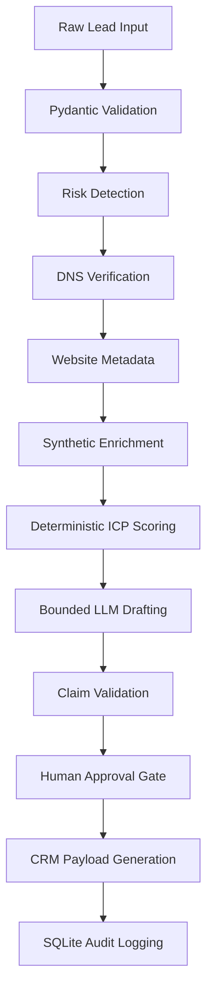

# LeadFlow AI — Inbound Lead Operating System

> **Applied AI Engineer Assessment | 5-Day Remote AI OS Sprint**  
> **Author:** Awais Saeed | Applied AI Engineer Candidate  
> **Target User:** Non-developer Inbound Sales Development Representative (SDR)  
> **Secondary User:** Revenue Operations Manager (RevOps)

## Problem

Inbound Sales Development Representatives (SDRs) at B2B SaaS companies face a recurring operational bottleneck: the manual qualification and enrichment interval between inbound lead submission and approved first-touch sales action. This process consumed 16 minutes 45 seconds per lead across 7 browser tabs with 5 context switches, creating response delays that impact conversion rates.

## Target User

**Primary:** Non-developer Inbound Sales Development Representatives (SDRs) who need to qualify, enrich, and respond to inbound leads quickly and consistently.

**Secondary:** Revenue Operations Managers (RevOps) who need audit trails, consistent routing, and governance over sales communications.

## What the System Does

LeadFlow AI is an auditable, human-governed AI operating system that eliminates the manual research and qualification interval between inbound lead submission and approved sales outreach:

1. **Validates** untrusted inbound form inputs using Pydantic schemas
2. **Verifies** domains via real DNS-over-HTTPS checks (Cloudflare)
3. **Inspects** company websites via public HTTP metadata extraction
4. **Enriches** leads using synthetic company account records
5. **Calculates** deterministic ICP fit scores (0–100) using explicit arithmetic
6. **Detects** prompt injection attempts and quarantines competitor reconnaissance
7. **Drafts** personalized sales outreach using bounded LLM generation
8. **Validates** commercial claims to block unauthorized discounts/SLAs
9. **Enforces** mandatory human approval before any CRM dispatch
10. **Logs** every decision to an append-only SQLite audit database

## Why It Exists

The system addresses three critical challenges:
- **Speed:** Reduces processing time from 16m45s to ~2.3 seconds
- **Safety:** Prevents unauthorized commercial commitments and competitor exposure
- **Governance:** Maintains human control with complete audit trails

## Five-Day Scope

- **Day 1:** Problem discovery, baseline measurements, benchmark design
- **Day 2:** System architecture, core pipeline, automated tests
- **Day 3:** Real integrations, end-to-end workflow, benchmark validation
- **Day 4:** Failure analysis, security hardening, reliability testing
- **Day 5:** Final packaging, documentation, handoff preparation

## What Is Included

✅ **Complete Working System**
- FastAPI backend with 11 Pydantic data contracts
- Single-page web dashboard at localhost:8000
- Real DNS verification (Cloudflare DNS-over-HTTPS)
- Real website metadata extraction
- Deterministic ICP scoring engine
- LLM draft generation with deterministic fallbacks
- Commercial claim validation
- Mandatory human approval workflow
- SQLite audit logging

✅ **Comprehensive Testing**
- 56/56 automated tests (unit, integration, security)
- 12/12 benchmark cases with tier/score/route validation
- 10/10 deliberate failure injection tests
- Security regression testing
- Proxy user validation

✅ **Complete Documentation**
- User guides for non-developers
- Operator runbooks for maintenance
- Architecture diagrams and data flow
- Evaluation evidence and limitations
- Demo scripts and case study

## What Is Not Included

❌ **Production Deployment**
- No live CRM integrations (generates structured payloads only)
- No production infrastructure or hosting
- No real customer data processing
- No autonomous sales outreach without human approval

❌ **Advanced Features**
- No multi-language support beyond basic templates
- No advanced semantic prompt injection detection
- No real-time external enrichment APIs (uses synthetic dataset)
- No multi-tenant architecture

## Architecture

LeadFlow AI follows a **hybrid architecture** that separates trusted deterministic components from untrusted generative components:



### Trust Boundaries

**TRUSTED (Deterministic):**
- Pydantic validation
- DNS verification results
- ICP scoring arithmetic
- Routing logic
- Claim validation regex
- Approval state machine
- Audit logging

**UNTRUSTED (External/Generated):**
- Lead notes and form input
- Website content
- LLM draft output
- External API responses

**HUMAN-CONTROLLED:**
- Final approval decisions
- Lead quarantine actions
- Draft editing and review

## Data Flow

1. **Input:** Untrusted lead form submission
2. **Validation:** Pydantic schema enforcement at API boundary
3. **Risk Assessment:** Prompt injection and competitor domain detection
4. **External Verification:** DNS-over-HTTPS and website metadata
5. **Enrichment:** Synthetic company dataset lookup
6. **Scoring:** Deterministic arithmetic: max(0, Firm + Role + Intent + Urgency - Penalties)
7. **Drafting:** Bounded LLM generation with verified facts only
8. **Claim Validation:** Regex-based commercial policy enforcement
9. **Human Review:** Mandatory approval with PREVIEW_ONLY → APPROVED_FOR_DISPATCH
10. **Audit:** Complete decision trail in append-only SQLite database

## External Integrations

- **DNS Verification:** Cloudflare DNS-over-HTTPS (1.1.1.1)
- **Website Metadata:** Direct HTTP requests with 5-second timeout
- **LLM Provider:** Google Gemini with deterministic template fallback
- **No Credentials Required:** All integrations use public endpoints

## Human Approval Boundary

The system enforces strict human governance:
- **Standard leads:** Initialize to `PENDING_REVIEW` with `dispatch_authorized = False`
- **Flagged leads:** Initialize to `QUARANTINED` with automatic blocking
- **Required Actions:** Human must explicitly approve, edit, or quarantine each lead
- **Claim Validation:** Unsafe commercial commitments block approval
- **Edit Protection:** Final drafts are re-validated before approval
- **State Tracking:** Complete approval audit trail with timestamps and reviewer ID

## Security

- **Input Validation:** Pydantic schemas prevent malformed data
- **Prompt Injection Detection:** Regex-based quarantine for manipulation attempts
- **Competitor Protection:** Automatic quarantine of competitor domains
- **Commercial Claim Governance:** Blocks unauthorized discounts, SLAs, compliance claims
- **Approval Bypass Prevention:** Server-side invariants prevent quarantine approval
- **Edit Tampering Protection:** Re-validation on approval prevents claim smuggling
- **Audit Completeness:** Every decision logged to append-only SQLite

## How to Run

### Quick Start (3 Steps)

1. **Install Dependencies**
   ```bash
   cd day2
   pip install -r requirements.txt
   ```

2. **Start Application**
   ```bash
   # Windows: Double-click start_leadflow.bat
   # OR manually:
   cd day2
   python -m uvicorn backend.app.main:app --host 0.0.0.0 --port 8000 --reload
   ```

3. **Open Web Interface**
   Navigate to: `http://localhost:8000`

### Detailed Setup

See `QUICKSTART.md` for complete setup instructions including troubleshooting.

## How to Process a Lead

1. Open web dashboard at `localhost:8000`
2. Select a benchmark preset (e.g., "TC-01: Enterprise Buyer")
3. Click **"Process Inbound Lead"**
4. Review the results:
   - DNS verification status
   - Website metadata
   - Company enrichment
   - ICP score breakdown (0-100)
   - Tier classification (1/2/3)
   - Routing recommendation
   - Generated email draft
5. Examine claim validation results
6. Choose action: **Approve & Dispatch**, **Edit Draft**, or **Quarantine**
7. Verify final status: `APPROVED_FOR_DISPATCH` or `QUARANTINED`
8. Check audit log for complete decision trail

## Evaluation

### Baseline Measurements
- **Manual SDR Process:** 16m45s per lead, 7 browser tabs, 5 context switches
- **ChatGPT-Assisted:** 11m10s per lead, 5.7/10 quality (hallucination-prone)
- **LeadFlow AI:** 2.3 seconds average, 12/12 benchmark accuracy

### Day 4 Reliability Evidence
- **Automated Tests:** 56/56 passing (100%)
- **12-Case Benchmark:** 12/12 perfect tier, score, and routing match
- **Failure Injection:** 10/10 deliberate break tests with bounded degradation
- **Security Tests:** 100% quarantine accuracy, zero approval bypasses
- **External Integration:** Real DNS and website verification working
- **Human Approval:** Complete state machine validation

### Performance Metrics
- **Processing Time:** 99.8% reduction (16m45s → 2.3s average)
- **DNS Latency:** 289-1001ms (network dependent)
- **Website Latency:** 0-3419ms (bounded by 5.0s timeout)
- **Benchmark Accuracy:** 100% tier, score, and route precision

## Known Limitations

### Technical Limitations
- **Synthetic Dataset:** Uses local company records, not live enrichment APIs
- **Network Dependency:** DNS and website checks depend on external availability
- **LLM Variability:** Draft quality depends on provider availability and performance
- **Regex Risk Detection:** May miss sophisticated prompt injection techniques
- **Local Storage:** SQLite audit database not suitable for high-concurrent production

### Scope Limitations
- **No Live CRM:** Generates structured payloads but doesn't dispatch to production CRMs
- **No Production Infrastructure:** Designed for evaluation environment only
- **Human Required:** Cannot operate autonomously without approval
- **Synthetic Data Only:** No real customer PII processing

### Environment Dependencies
- **Python 3.11+** required
- **Internet connectivity** needed for DNS/website verification
- **Local execution** only (not containerized or cloud-ready)
- **Single session** handling (not multi-tenant)

## Repository Structure

```
leadflow-ai-final/
├── README.md                    # This file
├── QUICKSTART.md               # 3-step setup guide
├── start_leadflow.bat          # One-click Windows startup
├── day1/                       # Discovery and baseline
├── day2/                       # Core system implementation
├── day3/                       # Integration and benchmarks
├── day4/                       # Hardening and reliability
├── day5/                       # Final packaging and handoff
├── docs/                       # Technical documentation
│   ├── architecture.md         # System architecture
│   ├── data-flow.md           # Complete data flow
│   ├── evaluation.md          # Evidence and metrics
│   ├── limitations.md         # Honest limitation assessment
│   ├── troubleshooting.md     # Common issues and solutions
│   └── improvement-plan.md    # Future iteration roadmap
├── case_study/                 # Portfolio-ready case study
│   └── leadflow_case_study.md # Complete project narrative
├── operations/                 # Operational guides
│   ├── operator_runbook.md    # Daily operations
│   ├── maintenance.md         # System maintenance
│   └── incident_playbook.md   # Failure response procedures
└── evidence/                   # Final validation evidence
    ├── final_test_execution.txt
    ├── final_benchmark_results.csv
    ├── final_benchmark_results.json
    └── final_validation_summary.md
```

## Tests

### Automated Test Suite
```bash
cd day2
pytest backend/tests/test_pipeline.py -v
```
**Result:** 56/56 tests passing

### Benchmark Suite
```bash
python day3/benchmark/run_12_case_benchmark.py
```
**Result:** 12/12 cases with perfect tier, score, and routing accuracy

### Failure Injection Suite
```bash
python day4/break_tests/run_break_tests.py
```
**Result:** 10/10 deliberate failures handled with bounded degradation

## Benchmark

The 12-case benchmark validates three dimensions simultaneously:
- **Tier Classification:** Tier 1 (enterprise), Tier 2 (commercial), Tier 3 (self-serve)
- **ICP Score:** 0-100 arithmetic precision to expected ranges
- **Routing Action:** Correct next action (AE assignment, express onboarding, quarantine)

All 12 test cases achieve perfect accuracy across all three dimensions.

## Operator Handoff

### For Daily Operations
- See `operations/operator_runbook.md` for startup, monitoring, and basic troubleshooting
- See `docs/user_readme.md` for non-developer SDR guidance

### For System Maintenance
- See `operations/maintenance.md` for configuration changes and updates
- See `operations/incident_playbook.md` for failure response procedures

### For Future Development
- See `docs/improvement-plan.md` for prioritized enhancement roadmap
- See `day5/adoption_plan.csv` for operational metrics and targets

## Future Improvements

### Priority 0 (Critical)
- Production CRM integration with controlled permissions
- Advanced semantic prompt injection detection
- Production-grade audit storage and monitoring

### Priority 1 (Important)
- External enrichment API integrations (Clearbit, Apollo)
- Multi-language template support
- Automated monitoring and alerting

### Priority 2 (Enhancement)
- Advanced reporting and analytics
- Model/provider optimization
- Multi-tenant architecture

See `docs/improvement-plan.md` for detailed roadmap with validation methods and risk assessment.

---

**System Status:** Ready for handoff and demonstration  
**Final Package:** Complete with documentation, evidence, and operational guides  
**Reproducibility:** Verified through independent setup and execution  
**Limitations:** Explicitly documented with honest scope acknowledgment